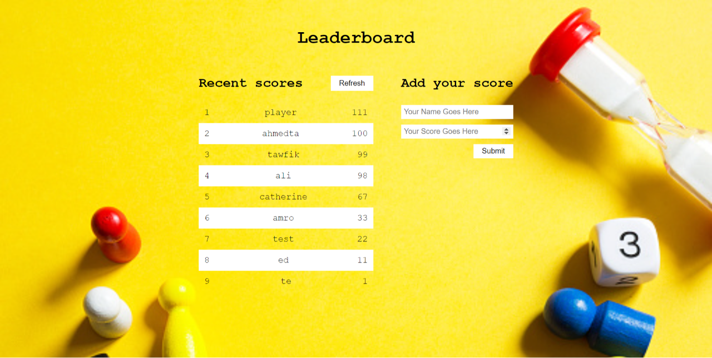

# Leaderboard

The leaderboard website displays scores submitted by different players. It also allows you to submit your score. All data is preserved thanks to the external [Leaderboard API service](https://www.notion.so/Leaderboard-API-service-24c0c3c116974ac49488d4eb0267ade3)

## Screenshot



## Built using

- HTML
- CSS
- JavaScript
- Webpack

## Getting Started

follow thies steps to setup the project

```
git clone git@github.com:ahmedtaa/LeaderBoard.git
cd leaderboard
npm install
npm start
```

## Authors

👤 **Author1**

- GitHub: [@ahmedta](https://github.com/ahmedta)
- Twitter: [@\_ahmedta](https://twitter.com/_ahmedta)

## 🤝 Contributing

Contributions, issues, and feature requests are welcome!

Feel free to check the [issues page](../../issues/).

## Show your support

Give a ⭐️ if you like this project!

## 📝 License

This project is [MIT](./MIT.md) licensed.
